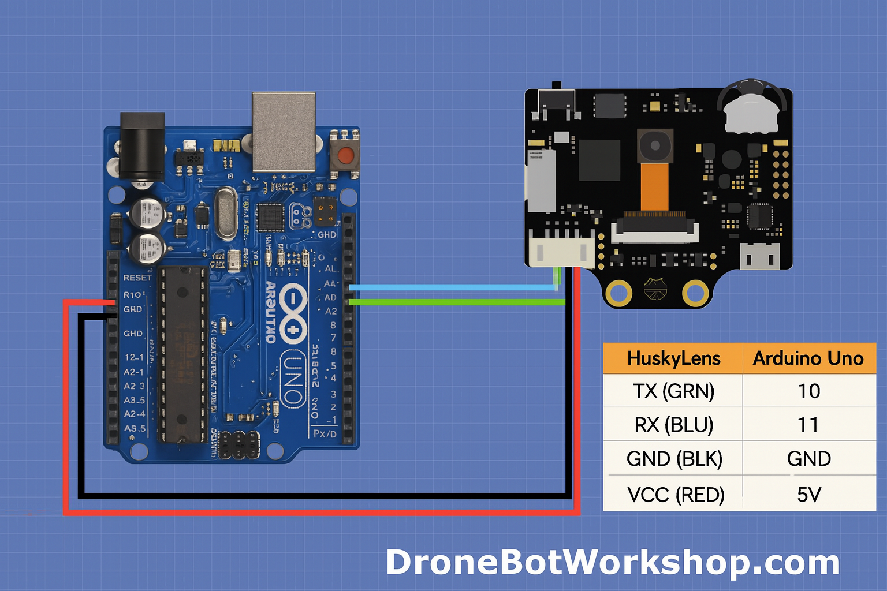

# 🎨 Color Detection with HuskyLens and Arduino

## 💡 Project Idea
This project uses the **HuskyLens AI Camera** and an **Arduino Uno** to recognize colors in real-time and print their names to the Serial Monitor.  
The goal is to explore color recognition using AI without complex training or coding — just plug and play with HuskyLens!

---

## 🧰 Components Used

| Component             | job |
|-----------------------|------------------------------------------------|
| Arduino Uno           | To display the color on the Serial Monitor     |
| HuskyLens AI Camera   | Using AI to recognize the environment         |
| Jumper Wires          | To send the data between Arduino and HuskyLens |

## 🔌 Wiring Table

| HuskyLens Pin | Arduino Pin |
|---------------|-------------|
| TX            | Pin 10      |
| RX            | Pin 11      |
| VCC           | 5V          |
| GND           | GND         |

---

## 📸 HuskyLens Modes

The **HuskyLens** supports several AI-powered modes, including:

- **Face Recognition** – Detects and recognizes faces
- 
- **Object Tracking** – Tracks learned objects.
- 
- **Color Recognition** – Detects and identifies trained colors.
- 
- **Object Classification** – Classifies objects using ML models.
- 
  
---
## 🧪 How It Works

1. On the HuskyLens, switch to **Color Recognition** mode.
2. Train it to recognize red and green objects by using the "Learn" button.
3. Upload the Arduino code.
4. Open the Serial Monitor to see detected color IDs and actions.
---
At the beginning, we trained the HuskyLens to recognize 3 colors:

- **ID 1** → Yellow  
- **ID 2** → Green  
- **ID 3** → Blue  

Once the training was complete, the HuskyLens would return the corresponding ID when it detects a color.

Example Serial Monitor output:

---
